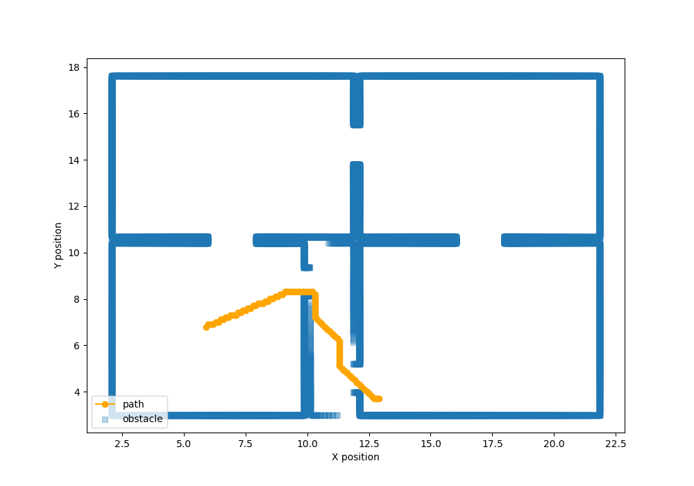

# Drone Flight Assignment

+ Author: Eric Bizet

## Purpose

+ Obstacle visualization
+ Alternative path finding

# Usage

## Requirements

All needed Python packages are in `requirements.txt`. If needed run:

```console
pip3 install -r requirements.txt
```

## Running the program

```console
python3 main.py
```

# Workflow

I decided to pick Python so I could use *Matplotlib* for easy visualisation while manipulating matrices. I wanted to try manipulating spatial data using *pandas* dataframes and *numpy* arrays for readibility and efficiency.

I started by creating a notebook for visualizing progression of data handling and processing. I took the liberty of adding some documentation in it, therefore feel free to check it out.

Once I had come up with solid data handling and good progression within the tasks, I started translating the code into a Python scripts.

## Data visualization

The idea behind it was computing the absolute position of every obstacle points obtained while scanning the set. I used the drone flight data to compute back the offset of each obstacle point.

Final dataframe look like this:

```python
       Scan       Angle  Distance          X         Y
0         0    1.096680    8964.0  21.834698  3.451423
1         0    1.771484    8967.0  21.835054  3.345790
2         0    2.446777    8970.0  21.834162  3.240049
3         0    3.121582    8976.0  21.835022  3.134203
4         0    3.796875    8982.0  21.834625  3.028207
...     ...         ...       ...        ...       ...
18126    33  357.600100    3986.0   9.865641  6.918299
18127    33  358.274900    3985.0   9.866331  6.871355
18128    33  358.949700    3984.0   9.866468  6.824417
18129    33  359.625000    3983.0   9.866052  6.777458
18130    33    0.299805    3983.0   9.866082  6.730549

[18094 rows x 5 columns]
```

Last thing to do was to plot the data using *matplotlib*.

Example for visualizing 6th scan data:


## Alternative path finding

For finding an alternative path that is faster, I wanted to try *A\* algorithm* for finding a shorter path.

Since the algorithm works on grids, I had to perform some processing of the spatial data to discretize obstacle data. 
I created buckets for each 'pixel' and accumulate LIDAR detection points. In real world use case, measurement might result in noise, so we can threshold the data to perform a clean up.

Here is what the accumulation map looks like:


We can filter out noise which yields the following binary map. Since it is a toy example, we can accept all measurements.


After discretizing our space, the subdivison serve as nodes for A* search. The following path is obtained:



In the discrete world, this would be the shortest path with the fewest 'pixel jumps', but in the real world this probably won't be.

Nevertheless, as an alternative path, we could consider it satisfactory. We can observe that the drone gets fairly close to the walls, which can be corrected by increasing the *drone_radius* parameter or by making the heuristic take into account the proximity to the walls.